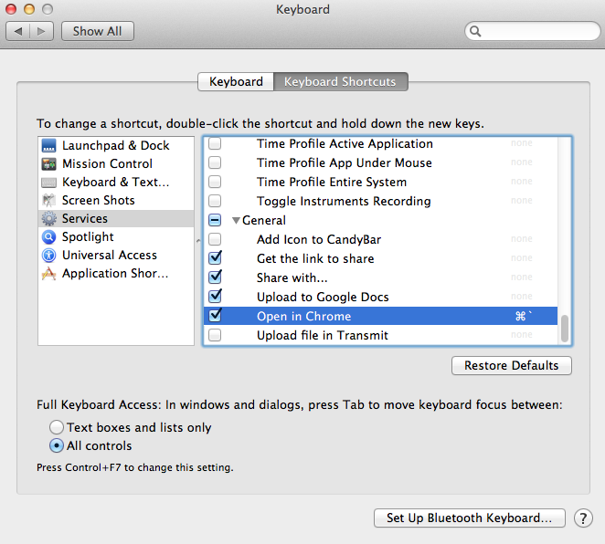

Open-in-Chrome
==============

Automator workflow that opens the current active Safari page in Google Chrome.  [John Grubers Post](http://daringfireball.net/2010/11/flash_free_and_cheating_with_google_chrome) explains why this is needed.

Note: This workflow leverages parts of [TJ Luoma's Applescript](http://www.tuaw.com/2011/03/14/use-applescript-to-open-current-safari-url-in-google-chrome/), but solves some issues I ran into where the Applescript would error out if chrome didn't currently have an active window.

## Usage

1. [Download](https://github.com/NicholasModesto/Open-in-Chrome/blob/master/open-in-chrome.workflow.zip) and extract the ZIP file.
2. Place the workflow file in "~/Library/Services/".
3. Open "System Preference > Keyboard > Keyboard Shortcuts > Services > General" (screen grab below).
4. Assign the "Open in Chrome" service and keyboard shortcut. Mine is set to " cmd + ` "

